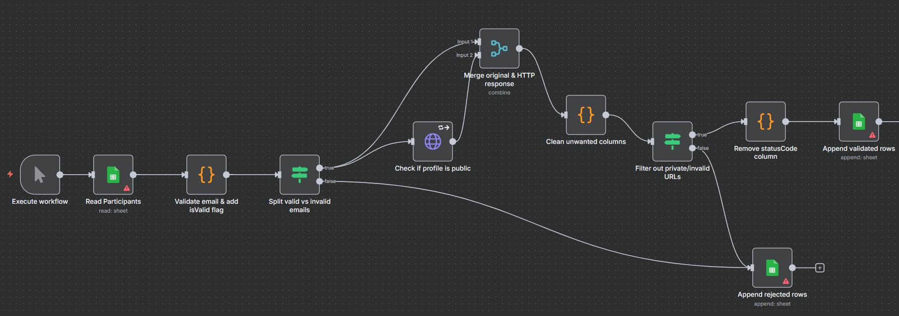

# Google Cloud Skills Boost Participant Validator (n8n Workflow)

This workflow automates validation of participant data for **Google Cloud Study Jams / Cloud Skills Boost programs** using Google Sheets.  
It verifies participant emails, checks the validity and public visibility of Cloud Skills Boost profile URLs, and categorizes entries into **validated** and **rejected** sheets.

---

## 🖼️ Workflow diagram

## 

## ⚙️ How It Works

| Step                            | Description                                                             |
| ------------------------------- | ----------------------------------------------------------------------- |
| **1. Manual Trigger**           | Starts the workflow manually.                                           |
| **2. Read Participants**        | Reads participant data from the input Google Sheet (`A:H` range).       |
| **3. Validate Fields**          | Ensures valid email formats and correct Skill Boost profile links.      |
| **4. Split Data**               | Separates valid and invalid rows.                                       |
| **5. Check Profile Visibility** | Sends HTTP requests to verify if Skill Boost profiles are public.       |
| **6. Merge Results**            | Combines original participant data with HTTP responses.                 |
| **7. Clean Data**               | Removes unnecessary fields (`headers`, `statusCode`, etc.).             |
| **8. Output**                   | Appends valid entries to one sheet and invalid/private ones to another. |

---

## 🧠 Validation Logic

- **Email validation:** Uses regex for both `Email Address` and `skill boost email`.
- **Profile URL validation:** Ensures URL includes cloudskillsboost.google/public_profiles
- **Profile visibility check:**
- **Status 200 →** profile is public
- **Other →** invalid or private

---

## 🗂️ Google Sheets Setup

You need **three Google Sheets**:

| Purpose         | Env Variable         | Description                                                        |
| --------------- | -------------------- | ------------------------------------------------------------------ |
| Input sheet     | `SOURCE_SHEET_ID`    | Contains participant data (emails, Skill Boost email, profile URL) |
| Validated sheet | `VALIDATED_SHEET_ID` | Stores valid and public profiles                                   |
| Rejected sheet  | `REJECTED_SHEET_ID`  | Stores invalid or private profiles                                 |

---

## 🚀 How to Use

- Launch n8n (http://localhost:5678).

- Import the workflow JSON file.

- Connect your Google Sheets OAuth2 credentials when prompted.

- Run the workflow manually.

- Check your Google Sheets for validated and rejected participant data.

## 🧰 Requirements

- n8n (desktop or self-hosted)

- Google Sheets API OAuth2 credentials

- Input sheet with these columns:

```
Email Address | skill boost email | skill boost profile
```

## 🪄 Example Flow

```
Manual Trigger
   ↓
Read Participants
   ↓
Validate Emails & URLs
   ↓
Split (Valid / Invalid)
   ↓
HTTP Check for Public Profiles
   ↓
Filter Private URLs
   ↓
Append to Validated / Rejected Sheets
```

## 🧾 License

- Released under the MIT License — free to use, modify, and share with attribution.
